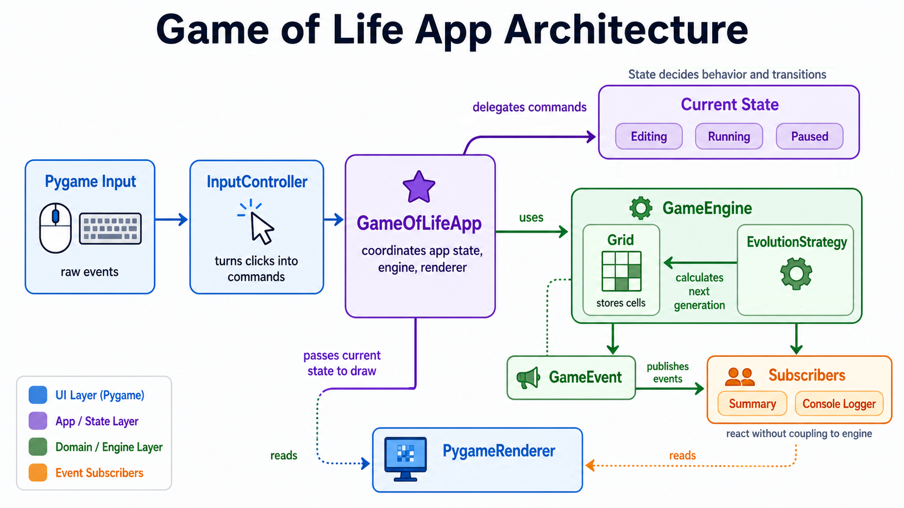

# Game of Life Design Patterns Study

This project refactors a small Pygame implementation of Conway's Game of Life
to study design patterns in a practical codebase.

The original version is kept in `game_of_life_001.py` as a reference. The
refactored implementation lives under `src/game_of_life/`.

## Architecture

The project follows a simple Model-View-Controller-style structure:

| Layer | Responsibility | Main files |
| --- | --- | --- |
| Model / Domain | Grid data, generations, rules, events | `domain/`, `strategies/`, `observers/` |
| View | Drawing cells, controls, and summary values | `pygame_ui/renderer.py` |
| Controller | Translating Pygame input into app commands | `pygame_ui/controller.py` |
| Application | Connecting engine, state, renderer, and controller | `app.py` |

The key rule is that Pygame stays in the UI layer. Domain classes such as
`Grid`, `GameEngine`, and the strategies do not import Pygame.

## High-Level Flow



The runtime flow is intentionally split into input, update, event publication,
and rendering:

```text
Pygame event
-> InputController
-> SimulationCommand
-> GameOfLifeApp
-> current SimulationState
-> GameEngine
-> Grid / EvolutionStrategy
-> GameEvent
-> Subscribers
```

The renderer is separate from the domain flow. It reads the current app state,
engine grid, and summary values, then draws the frame with Pygame.

## Design Patterns

### Strategy

The evolution rules are implemented as interchangeable strategies:

- `EvolutionStrategy`
- `ConwayEvolutionStrategy`
- `HighLifeEvolutionStrategy`

`GameEngine` does not know the details of Conway or HighLife. It only calls:

```python
next_cells = strategy.calculate_next_state(grid)
```

This lets the app replace the evolution algorithm without rewriting the engine.

### Publisher / Subscriber

`GameEngine` is a `Publisher[GameEvent]`. It publishes events when the
simulation changes.

Current subscribers:

- `SimulationSummarySubscriber`: keeps the latest generation/cell summary.
- `ConsoleLoggingSubscriber`: logs engine events through Python logging.

The engine only knows the `Subscriber[GameEvent]` interface, not concrete
subscriber classes.

`GameOfLifeApp` does not depend on `SimulationSummarySubscriber` directly. It
depends on the read-only `SimulationSummary` protocol, because the app only
needs summary values for rendering. The same concrete object can therefore play
two roles:

- as a `Subscriber[GameEvent]`, it receives engine events;
- as a `SimulationSummary`, it exposes current summary values to the app.

### State

`GameOfLifeApp` owns the current `SimulationState`.

Current states:

- `EditingState`: stopped and editable.
- `RunningState`: advances generations automatically.
- `PausedState`: stopped and locked.

The app delegates commands and update ticks to the current state:

```python
current_state.handle_event(app, command)
current_state.update(app, delta_time)
```

This avoids spreading `if mode == ...` checks across the application.

### Factory

The state objects use a small factory to create the next concrete state:

- `StateFactory`
- `SimulationStateFactory`

The transition decision still belongs to the current state. For example,
`EditingState` decides that `START` should move to `RunningState`. The factory
only centralizes object creation:

```python
next_state = context.state_factory.create_running(
    evolution_interval=context.evolution_interval
)
context.change_state(next_state)
```

This avoids direct imports between concrete state classes while keeping the
State pattern easy to read.

## Project Structure

```text
src/game_of_life/
├── app.py
├── config.py
├── domain/
│   ├── engine.py
│   ├── events.py
│   └── grid.py
├── observers/
│   ├── base.py
│   ├── console_logger.py
│   └── simulation_summary.py
├── pygame_ui/
│   ├── controller.py
│   └── renderer.py
├── states/
│   ├── base.py
│   ├── editing.py
│   ├── factory.py
│   ├── paused.py
│   └── running.py
└── strategies/
    ├── base.py
    ├── conway.py
    └── highlife.py
```

## Diagrams

- [Class diagram](docs/class_diagram.md)
- [Publisher/subscriber diagram](docs/publisher_subscriber_diagram.md)
- [State diagram](docs/state_diagram.md)

## Configuration

Runtime configuration lives in `src/game_of_life/config.py`. This file groups
the values that control window size, grid size, simulation speed, logging, and
colors.

Main values:

| Variable | Purpose |
| --- | --- |
| `SCREEN_WIDTH` | Width of the Pygame window in pixels. |
| `TOOLBAR_HEIGHT` | Height of the bottom toolbar area. |
| `GRID_COLUMNS` | Number of columns in the Game of Life grid. |
| `GRID_ROWS` | Number of rows in the Game of Life grid. |
| `CELL_SIZE` | Size of each rendered cell in pixels. |
| `GRID_WIDTH` | Derived grid width: `GRID_COLUMNS * CELL_SIZE`. |
| `GRID_HEIGHT` | Derived grid height: `GRID_ROWS * CELL_SIZE`. |
| `SCREEN_HEIGHT` | Derived window height: `GRID_HEIGHT + TOOLBAR_HEIGHT`. |
| `FPS` | Maximum frames per second for the Pygame loop. |
| `EVOLUTION_INTERVAL` | Seconds between automatic generations while running. |
| `RANDOM_ALIVE_PROBABILITY` | Probability used when randomizing the grid. |
| `LOG_LEVEL` | Python logging level used by the application. |
| Color constants | RGB values used by the renderer. |

For example, to make the simulation evolve more slowly, increase
`EVOLUTION_INTERVAL`. To make the board larger, increase `GRID_COLUMNS` or
`GRID_ROWS`.

## Install

This project targets Python 3.12. The package metadata restricts Python to
`>=3.12,<3.13` because Pygame wheel support can vary across newer Python
versions.

Create and activate a virtual environment, then install the project in editable
mode:

```bash
python3.12 -m venv .venv
source .venv/bin/activate
python -m pip install -e ".[dev]"
```

Runtime dependencies:

- `numpy`
- `pygame`

Development dependency:

- `pytest`

If you use `uv`, install the project with:

```bash
uv sync
```

## Run

After installing the project:

```bash
python -m game_of_life.app
```

Without installing the project, use:

```bash
PYTHONPATH=src python -m game_of_life.app
```

With `uv`, use:

```bash
uv run python -m game_of_life.app
```

## Run With Docker

Build the image:

```bash
docker build -t game-of-life-patterns .
```

Run the Pygame application with Linux/X11 display forwarding:

```bash
xhost +local:docker
docker run --rm -it \
  -e DISPLAY=$DISPLAY \
  -v /tmp/.X11-unix:/tmp/.X11-unix \
  game-of-life-patterns
```

Pygame opens a real window, so the container needs access to your host display.
If your desktop uses Wayland, this usually still works through XWayland when
`DISPLAY` is available.

## Controls

Editing mode:

- Click cells to toggle them.
- `Start`: begin automatic evolution.
- `Next`: advance one generation manually.
- `Random`: randomize the grid.
- `Clear`: clear all cells.
- `Use HighLife` / `Use Conway`: switch the evolution strategy.

Running mode:

- `Pause`: pause the simulation.
- `Edit`: return to editing mode.

Paused mode:

- `Resume`: continue running.

## Tests

Run the real test suite:

```bash
pytest
```

With `uv`:

```bash
uv run pytest
```

The root-level `test_*.py` files are manual learning playgrounds. They print
step-by-step examples and can be deleted later.

## Study Notes

This is a study repository. Some choices are intentionally pattern-focused so
the Strategy, State, Publisher/Subscriber, and Factory patterns are easier to
see in code.

The implementation is not meant to be a perfect or definitive architecture for
Game of Life. The same problem could be solved with different patterns,
different boundaries, or a smaller design depending on the goal.
