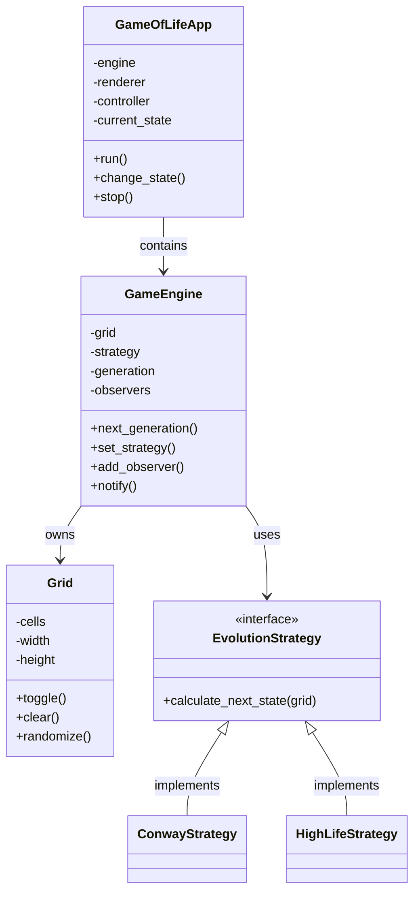

```mermaid
classDiagram
    class GameOfLifeApp {
        -engine
        -renderer
        -controller
        -current_state
        +run()
        +change_state()
        +stop()
    }

    class GameEngine {
        -grid
        -strategy
        -generation
        -observers
        +next_generation()
        +set_strategy()
        +add_observer()
        +notify()
    }

    class Grid {
        -cells
        -width
        -height
        +toggle()
        +clear()
        +randomize()
    }

    class EvolutionStrategy {
        <<interface>>
        +calculate_next_state(grid)
    }

    class ConwayStrategy {
    }

    class HighLifeStrategy {
    }

    GameOfLifeApp --> GameEngine : contains
    GameEngine --> Grid : owns
    GameEngine --> EvolutionStrategy : uses
    EvolutionStrategy <|-- ConwayStrategy : implements
    EvolutionStrategy <|-- HighLifeStrategy : implements
```