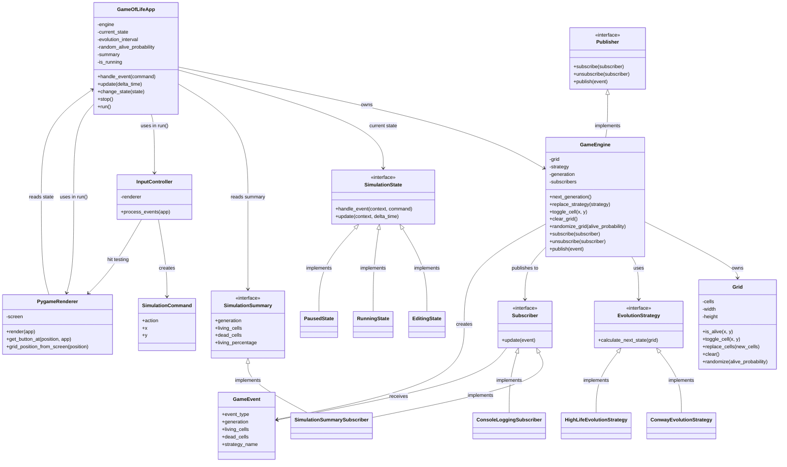

```mermaid
classDiagram
    class GameOfLifeApp {
        -engine
        -current_state
        -evolution_interval
        -random_alive_probability
        -summary
        -is_running
        +handle_event(command)
        +update(delta_time)
        +change_state(state)
        +stop()
        +run()
    }

    class InputController {
        -renderer
        +process_events(app)
    }

    class PygameRenderer {
        -screen
        +render(app)
        +get_button_at(position, app)
        +grid_position_from_screen(position)
    }

    class SimulationCommand {
        +action
        +x
        +y
    }

    class SimulationState {
        <<interface>>
        +handle_event(context, command)
        +update(context, delta_time)
    }

    class EditingState
    class RunningState
    class PausedState

    class GameEngine {
        -grid
        -strategy
        -generation
        -subscribers
        +next_generation()
        +replace_strategy(strategy)
        +toggle_cell(x, y)
        +clear_grid()
        +randomize_grid(alive_probability)
        +subscribe(subscriber)
        +unsubscribe(subscriber)
        +publish(event)
    }

    class Grid {
        -cells
        -width
        -height
        +is_alive(x, y)
        +toggle_cell(x, y)
        +replace_cells(new_cells)
        +clear()
        +randomize(alive_probability)
    }

    class EvolutionStrategy {
        <<interface>>
        +calculate_next_state(grid)
    }

    class ConwayEvolutionStrategy
    class HighLifeEvolutionStrategy

    class Publisher {
        <<interface>>
        +subscribe(subscriber)
        +unsubscribe(subscriber)
        +publish(event)
    }

    class Subscriber {
        <<interface>>
        +update(event)
    }

    class GameEvent {
        +event_type
        +generation
        +living_cells
        +dead_cells
        +strategy_name
    }

    class SimulationSummary {
        <<interface>>
        +generation
        +living_cells
        +dead_cells
        +living_percentage
    }

    class SimulationSummarySubscriber
    class ConsoleLoggingSubscriber

    GameOfLifeApp --> GameEngine : owns
    GameOfLifeApp --> SimulationState : current state
    GameOfLifeApp --> SimulationSummary : reads summary
    GameOfLifeApp --> InputController : uses in run()
    GameOfLifeApp --> PygameRenderer : uses in run()

    InputController --> SimulationCommand : creates
    InputController --> PygameRenderer : hit testing
    PygameRenderer --> GameOfLifeApp : reads state

    SimulationState <|-- EditingState : implements
    SimulationState <|-- RunningState : implements
    SimulationState <|-- PausedState : implements

    Publisher <|-- GameEngine : implements
    GameEngine --> Grid : owns
    GameEngine --> EvolutionStrategy : uses
    GameEngine --> Subscriber : publishes to
    GameEngine --> GameEvent : creates

    EvolutionStrategy <|-- ConwayEvolutionStrategy : implements
    EvolutionStrategy <|-- HighLifeEvolutionStrategy : implements

    Subscriber <|-- SimulationSummarySubscriber : implements
    Subscriber <|-- ConsoleLoggingSubscriber : implements
    SimulationSummary <|-- SimulationSummarySubscriber : implements
    Subscriber --> GameEvent : receives
```
