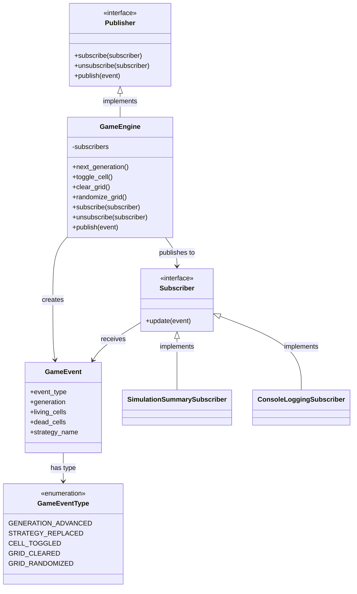

```mermaid
classDiagram
    class Publisher {
        <<interface>>
        +subscribe(subscriber)
        +unsubscribe(subscriber)
        +publish(event)
    }

    class Subscriber {
        <<interface>>
        +update(event)
    }

    class GameEngine {
        -subscribers
        +next_generation()
        +toggle_cell()
        +clear_grid()
        +randomize_grid()
        +subscribe(subscriber)
        +unsubscribe(subscriber)
        +publish(event)
    }

    class GameEvent {
        +event_type
        +generation
        +living_cells
        +dead_cells
        +strategy_name
    }

    class GameEventType {
        <<enumeration>>
        GENERATION_ADVANCED
        STRATEGY_REPLACED
        CELL_TOGGLED
        GRID_CLEARED
        GRID_RANDOMIZED
    }

    class SimulationSummarySubscriber {
    }

    class ConsoleLoggingSubscriber {
    }

    Publisher <|-- GameEngine : implements
    Subscriber <|-- SimulationSummarySubscriber : implements
    Subscriber <|-- ConsoleLoggingSubscriber : implements
    GameEngine --> Subscriber : publishes to
    GameEngine --> GameEvent : creates
    GameEvent --> GameEventType : has type
    Subscriber --> GameEvent : receives
```
