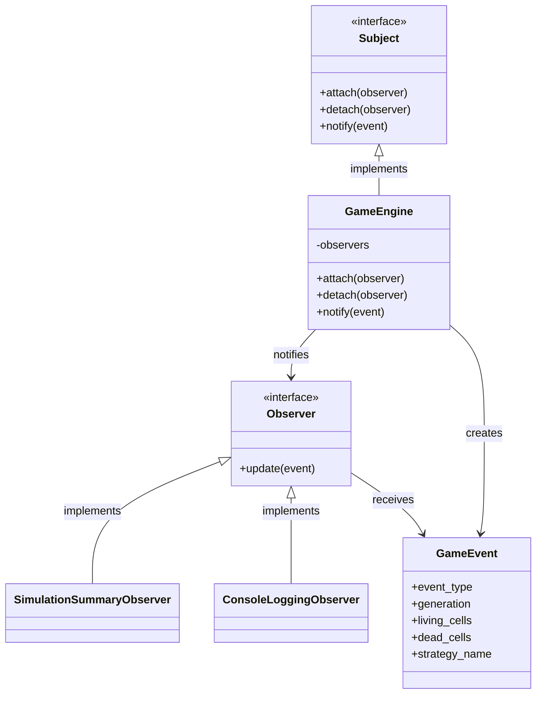

```mermaid
classDiagram
    class Subject {
        <<interface>>
        +attach(observer)
        +detach(observer)
        +notify(event)
    }

    class Observer {
        <<interface>>
        +update(event)
    }

    class GameEngine {
        -observers
        +attach(observer)
        +detach(observer)
        +notify(event)
    }

    class GameEvent {
        +event_type
        +generation
        +living_cells
        +dead_cells
        +strategy_name
    }

    class SimulationSummaryObserver {
    }

    class ConsoleLoggingObserver {
    }

    Subject <|-- GameEngine : implements
    Observer <|-- SimulationSummaryObserver : implements
    Observer <|-- ConsoleLoggingObserver : implements
    GameEngine --> Observer : notifies
    GameEngine --> GameEvent : creates
    Observer --> GameEvent : receives
```
