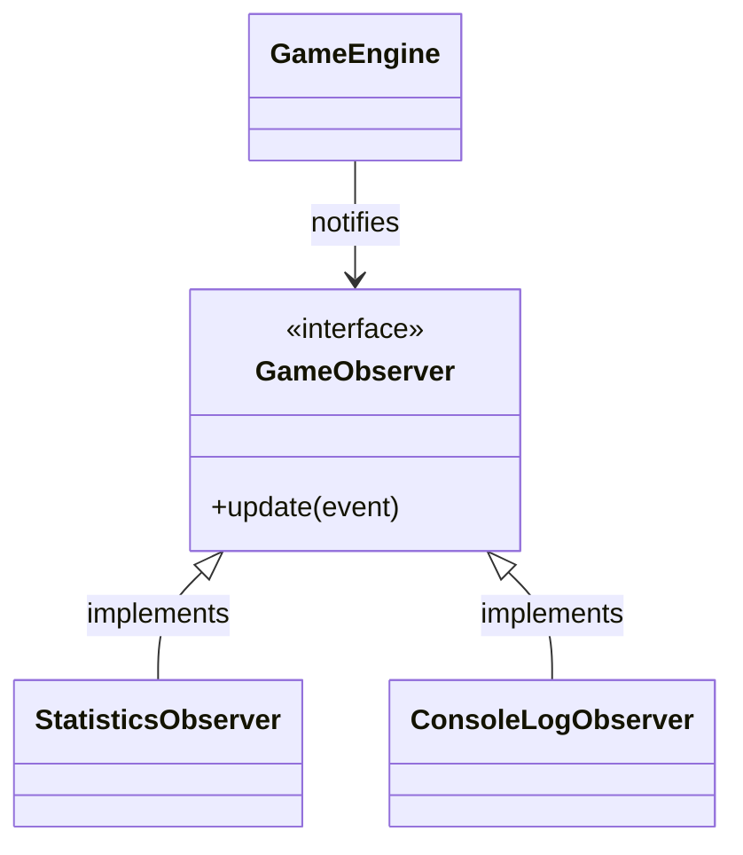

```mermaid
classDiagram
    class GameEngine {
    }

    class GameObserver {
        <<interface>>
        +update(event)
    }

    class StatisticsObserver {
    }

    class ConsoleLogObserver {
    }

    GameEngine --> GameObserver : notifies
    GameObserver <|-- StatisticsObserver : implements
    GameObserver <|-- ConsoleLogObserver : implements
```