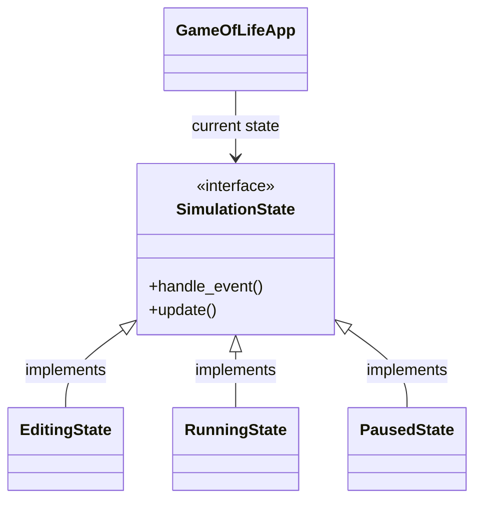
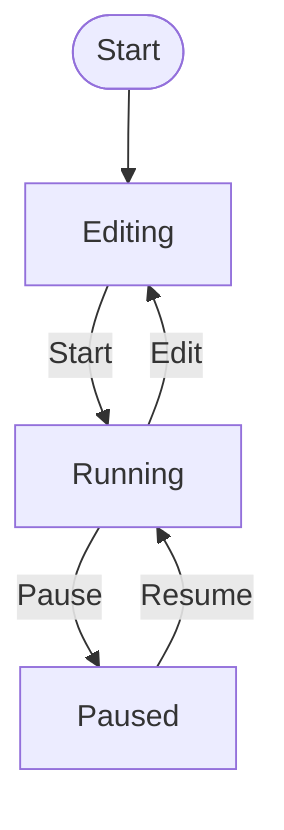

# State Class Implementation

```mermaid
classDiagram
    class GameOfLifeApp {
    }

    class SimulationState {
        <<interface>>
        +handle_event()
        +update()
    }

    class EditingState {
    }

    class RunningState {
    }

    class PausedState {
    }

    GameOfLifeApp --> SimulationState : current state
    SimulationState <|-- EditingState : implements
    SimulationState <|-- RunningState : implements
    SimulationState <|-- PausedState : implements
```
---
# State Workflow

```mermaid
graph TD
    Start([Start]) --> Editing[Editing]
    
    Editing -->|Start| Running[Running]
    Running -->|Edit| Editing
    
    Running -->|Pause| Paused[Paused]
    Paused -->|Resume| Running
```